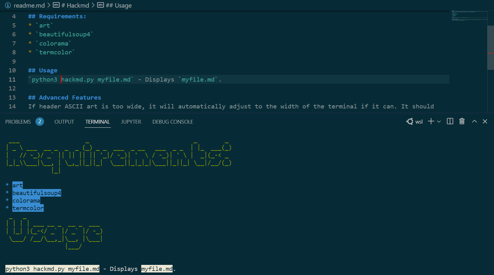

# Hackmd
Hackmd is a simple way to pretty-print markdown text in the terminal. It supports headers, links, lists, text formatting etc. and makes files nice to look at in a terminal environment.

## Requirements:
* `art`
* `beautifulsoup4`
* `colorama`
* `termcolor`

## Usage
`python3 hackmd.py myfile.md` - Displays `myfile.md`.

## Advanced Features
If header ASCII art is too wide, it will automatically adjust to the width of the terminal if it can. It should also work on Windows and Linux terminals.

## Demo
